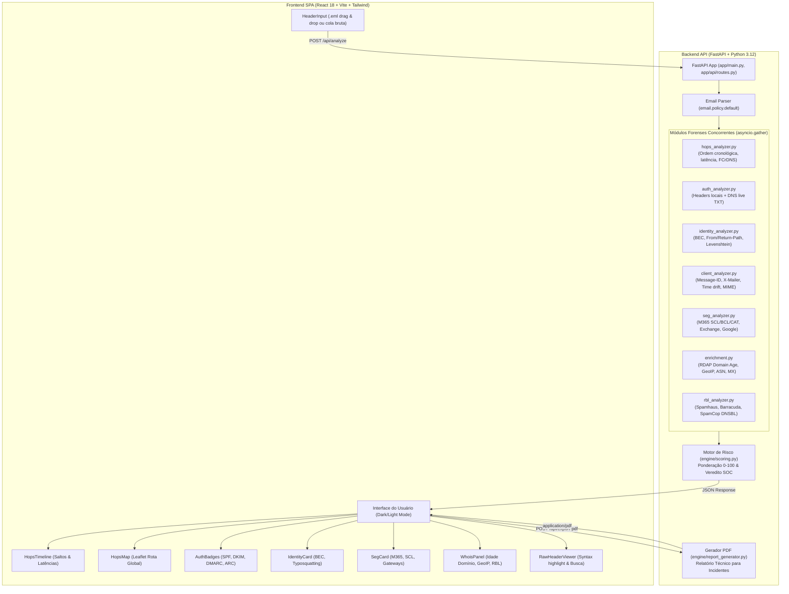
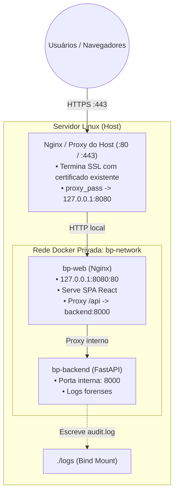

# bp-email-analiser 🛡️📧

> **Plataforma Forense Avançada de Análise de Cabeçalhos de E-mail e Detecção de Ameaças para SOC & Incident Response (DFIR).**

[](https://www.python.org/)
[](https://fastapi.tiangolo.com)
[](https://react.dev/)
[](https://www.typescriptlang.org/)
[](https://tailwindcss.com/)
[]()
[]()

---

## 📑 Sumário

- [Visão Geral](#-visão-geral)
- [Arquitetura do Sistema](#-arquitetura-do-sistema)
- [Principais Funcionalidades](#-principais-funcionalidades)
- [Motor de Pontuação de Risco (Risk Engine)](#-motor-de-pontuação-de-risco-risk-engine)
- [Inicialização Rápida (1 Comando)](#-inicialização-rápida-1-comando)
- [Instalação e Execução Manual](#-instalação-e-execução-manual)
- [Deploy em Produção](#-deploy-em-produção)
- [Guia da API REST](#-guia-da-api-rest)
- [Amostras e Casos de Uso Forense](#-amostras-e-casos-de-uso-forense)
- [Execução da Suíte de Testes](#-execução-da-suíte-de-testes)
- [Privacidade e Segurança](#-privacidade-e-segurança)
- [Estrutura do Repositório](#-estrutura-do-repositório)

---

## 🔍 Visão Geral

O **bp-email-analiser** é uma ferramenta web de investigação forense concebida para analistas de segurança (SOC L1/L2/L3), equipes de Resposta a Incidentes (DFIR) e pesquisadores de ameaças. A plataforma realiza a desmontagem completa de cabeçalhos de e-mail (RFC 5322 e RFC 5321) a partir de texto bruto ou arquivos `.eml`.

### Diferenciais Técnicos:
- **Processamento 100% em Memória**: Nenhum e-mail ou cabeçalho é persistido em disco ou banco de dados, garantindo conformidade com LGPD/GDPR e proteção de dados confidenciais corporativos.
- **Reordenação Cronológica de Saltos (`Received:`)**: Inverte a ordem física dos saltos MTA para reconstruir o trajeto real do remetente até o destinatário, medindo latências de trânsito em segundos/minutos.
- **Auditoria de FCrDNS (Forward-Confirmed reverse DNS)**: Valida se o PTR reverso resolve para um hostname cujos registros `A`/`AAAA` fecham ciclo com o IP original do salto.
- **Validação Cruzada Criptográfica**: Audita registros locais `Authentication-Results` / `Received-SPF` combinados com consultas DNS ao vivo para registros `v=spf1`, seletores DKIM (`_domainkey`), políticas DMARC (`p=none/quarantine/reject`) e blocos ARC.
- **Detecção de Fraudes de Identidade**: Alerta imediato contra *Display Name Spoofing* (ataques BEC com nomes de diretoria em webmails gratuitos), *Envelope Spoofing* (`From:` vs `Return-Path:`) e *Typosquatting/Homóglifos* no cabeçalho `Reply-To:`.
- **Decodificação de SEGs e Gateways**: Interpreta relatórios internos do Microsoft 365 (`X-Forefront-Antispam-Report` - SCL, BCL, CAT, SFV), Exchange AuthAs, Google Workspace e marcas de sandboxes.
- **Exportação Profissional para SOC**: Geração instantânea de relatórios executivos e técnicos em **PDF** (ReportLab) e **JSON** estruturado para ingestão em SIEM/SOAR.

---

## 🏗️ Arquitetura do Sistema

A aplicação é dividida em um backend assíncrono em Python e uma Single Page Application (SPA) moderna em React.



---

## 🚀 Principais Funcionalidades

### 1. Cadeia de Saltos (Hops) & Latência de Trânsito
- Inversão matemática da ordem física dos cabeçalhos `Received:`, estabelecendo a rota cronológica exata do salto inicial ao servidor de borda do destinatário.
- Extração de hostnames `from` e `by`, protocolos (ESMTP, ESMTPS, etc.) e carimbos de data/hora RFC 2822.
- Cálculo de atraso relativo entre saltos para identificar gargalos ou tentativas de retenção/manuseio deliberado de mensagens (> 30 minutos sinalizado como anômalo).

### 2. Validação FCrDNS (Forward-Confirmed reverse DNS)
- Realização de consulta PTR inversa sobre cada IP público de salto.
- Consulta `A`/`AAAA` subsequente sobre o hostname resolvido.
- Validação se o IP original condiz com o IP confirmado (resolução circular).
- Detecção heurística de conexões residenciais/dinâmicas (`*.dsl.*`, `*.dynamic.*`, `*.cable.*`, `*.pool.*`) disparando diretamente para servidores de correio.

### 3. Mapa Mundi Interativo de Rotas (Leaflet)
- Plotagem visual da rota de trânsito dos pacotes de e-mail sobre mapa escuro (CartoDB Dark).
- Marcadores com código de cores:
  - 🟢 **Verde**: FCrDNS verificado com sucesso.
  - 🔴 **Vermelho**: Falha de FCrDNS ou IP suspeito.
  - 🔵 **Azul**: Sem validação DNS / IP Interno RFC 1918.
- Linhas tracejadas conectando os saltos geolocalizados de origem até o destino.

### 4. Autenticação Criptográfica em Camadas
- **SPF**: Avaliação do status reportado (`Pass`, `Softfail`, `Fail`, `Neutral`, `None`) e consulta DNS ao vivo do registro `v=spf1`.
- **DKIM**: Inspeção da assinatura `DKIM-Signature` (`v=`, `d=`, `s=`, `a=`, `b=`), conferência do alinhamento de domínio com o `From:` e validação DNS da chave pública em `<selector>._domainkey.<domain>`.
- **DMARC**: Inspeção do alinhamento e consulta TXT ao vivo de `_dmarc.<domain>`, discriminando a política aplicada (`p=none`, `p=quarantine`, `p=reject`) e relatórios forenses.
- **ARC (Authenticated Received Chain)**: Validação de retransmissão de terceiros via `ARC-Seal`, `ARC-Message-Signature` e `ARC-Authentication-Results` (`cv=pass`, `cv=fail`).

### 5. Auditoria de Identidade, BEC e Typosquatting
- **Envelope vs Header From**: Detecção de divergência entre o domínio em `From:` (RFC 5322) e o domínio de retorno `Return-Path:` (RFC 5321).
- **BEC (Business Email Compromise)**: Algoritmo que detecta Display Names de executivos, diretoria, financeiro ou TI combinados com domínios de webmail gratuito (Gmail, Outlook, Yahoo, Hotmail, Proton).
- **Typosquatting no Reply-To**: Cálculo de distância de Levenshtein e verificação de caracteres homóglifos entre o remetente e o endereço de resposta para mitigar fraudes de redirecionamento silencioso.

### 6. Inteligência de Domínio e Reputação de IP
- **Idade do Domínio (RDAP)**: Alerta crítico para domínios registrados há menos de 30 dias (*burner domains*) ou menos de 90 dias (*domínios recentes*).
- **Registros MX**: Confirmação de existência de registros MX. Sinalização de ausência de MX ou ponteiros nulos/loopback (`127.0.0.1`).
- **Listas Negras DNSBL / RBL**: Consultas em tempo real às principais listas públicas:
  - `zen.spamhaus.org` (SBL, XBL, PBL)
  - `b.barracudacentral.org`
  - `bl.spamcop.net`

### 7. Decodificação de SEGs Corporativos & Análise MIME
- **Microsoft 365 (`X-Forefront-Antispam-Report`)**:
  - `SCL` (Spam Confidence Level): de -1 (interno) a 9 (spam extremo).
  - `BCL` (Bulk Complaint Level): de 0 a 9.
  - `CAT`: Phishing explícito (`CAT:PHSH`), Malware (`CAT:MALW`) ou Spam (`CAT:SPM`).
  - `SFV`: Ação do filtro (ex: Bypass de regra de transporte `SFV:SKS`).
- **Microsoft Exchange**: `X-MS-Exchange-Organization-AuthAs` (`Internal` vs `Anonymous`).
- **Análise MIME**: Inspeção de cabeçalhos `Content-Type` e `Content-Disposition` identificando extensões perigosas (`.exe`, `.scr`, `.vbs`, `.iso`, `.bat`, `.xlsm`, `.hta`, `.one`).
- **Descompasso Temporal (Drift)**: Divergência superior a 2 horas entre `Date:` do cliente e o primeiro carimbo `Received:`.

---

## 📊 Motor de Pontuação de Risco (Risk Engine)

O motor atribui pesos técnicos aos achados forenses e consolida o risco total em uma escala normalizada de **0 a 100**:

$$\text{Score Total} = \min\left(100, \sum \text{Pontos dos Achados}\right)$$

### Matriz de Pesos Forenses

| Categoria | Indicador Forense Detectado | Pontos | Severidade |
|---|---|:---:|:---:|
| **Identidade & BEC** | Display Name Spoofing (Nome Corporativo + Webmail Gratuito) | +30 | Crítico |
| | Typosquatting / Similaridade Homoglífica no `Reply-To` | +25 | Alto |
| | Divergência entre `From:` e `Return-Path` (Envelope Spoofing) | +15 | Médio |
| | Cabeçalho `Sender:` inconsistente com o `From:` | +10 | Médio |
| **Infraestrutura** | IP de origem listado em RBL (Spamhaus / Barracuda / SpamCop) | +25 | Crítico |
| | Domínio de envio registrado há menos de 30 dias (*Burner Domain*) | +20 | Alto |
| | Domínio de envio registrado entre 30 e 90 dias | +10 | Médio |
| | Domínio emissor sem registros MX ou com MX nulo | +20 | Alto |
| | Falha de FCrDNS no salto de origem | +15 | Médio |
| | IP de origem pertencente a pool dinâmico residencial (ADSL/Cable) | +10 | Baixo |
| **Autenticação** | Falha explícita de SPF (`Fail` ou `Permerror`) | +20 | Alto |
| | SPF `Softfail` ou `Neutral` | +10 | Médio |
| | Falha de DKIM / Assinatura criptográfica inválida | +20 | Alto |
| | Domínio sem registro SPF ou sem assinatura DKIM | +10 | Baixo |
| | Falha de DMARC (`dmarc=fail`) com política de quarentena/rejeição | +20 | Alto |
| | Falha de DMARC com política permissiva (`p=none`) | +10 | Médio |
| | Quebra na cadeia ARC em mensagem retransmitida | +10 | Baixo |
| **Metadados & SEGs** | Microsoft 365 com flag explícita de Phishing (`CAT:PHSH` ou `CAT:MALW`) | +25 | Crítico |
| | Microsoft 365 com Spam Confidence Level (`SCL`) >= 5 | +15 | Alto |
| | Anexo perigoso declarado em cabeçalho MIME (`.exe`, `.iso`, etc.) | +20 | Alto |
| | Descompasso temporal (`Date:` vs `Received:`) > 2 horas | +10 | Baixo |
| | `X-Mailer` indicando script ou ferramenta de spam em massa | +10 | Médio |
| | `Message-ID` malformado ou desconexo do domínio emissor | +10 | Baixo |

### Classificação de Risco

| Faixa de Pontuação | Nível | Ação Recomendada para o SOC |
|:---:|:---:|---|
| **0 a 25** | 🟢 **Seguro / Risco Baixo** | Nenhuma ação necessária. Mensagem atende a todos os critérios de autenticidade. |
| **26 a 50** | 🟡 **Informativo / Risco Moderado** | Monitorar. Inconsistências leves de configuração sem evidência de intencionalidade maliciosa. |
| **51 a 75** | 🟠 **Alto Risco / Suspeito** | Bloquear ou enviar para quarentena. Múltiplas falhas combinadas de autenticação e identidade. |
| **76 a 100** | 🔴 **Crítico / Ameaça Confirmada** | Contenção imediata. Indicadores inequívocos de BEC, phishing, malware ou IP comprometido. |

---

## ⚡ Inicialização Rápida (1 Comando)

O projeto inclui o script automatizado `run.sh`, responsável por preparar o ambiente virtual Python, instalar dependências, compilar o frontend e inicializar os servidores simultaneamente:

```bash
# Clone ou acesse o repositório
cd /home/breno/bp-email-analiser

# Execute o script de inicialização
./run.sh
```

O script disponibilizará:
- **Interface Web**: [http://localhost:5173](http://localhost:5173)
- **Documentação da API Swagger**: [http://localhost:8000/docs](http://localhost:8000/docs)
- **Documentação Redoc**: [http://localhost:8000/redoc](http://localhost:8000/redoc)

Para encerrar os servidores, pressione `Ctrl+C`.

---

## 🛠️ Instalação e Execução Manual

Caso prefira gerenciar os serviços separadamente:

### Pré-requisitos
- Python 3.12+
- Node.js 18+ (recomendado Node.js 20 ou 22)
- npm ou yarn

### 1. Configuração do Backend
```bash
cd backend

# Criar e ativar virtualenv
python3 -m venv .venv
source .venv/bin/activate

# Instalar dependências
pip install --upgrade pip
pip install -r requirements.txt

# Iniciar servidor FastAPI (porta 8000)
uvicorn app.main:app --host 0.0.0.0 --port 8000 --reload
```

### 2. Configuração do Frontend
```bash
cd frontend

# Instalar pacotes npm
npm install

# Compilar para produção (opcional)
npm run build

# Iniciar servidor de desenvolvimento Vite (porta 5173 com proxy reverso para :8000)
npm run dev
```

---

## 🐳 Deploy em Produção

Esta seção descreve a infraestrutura de produção pronta para implantação com contêineres Docker, operando de forma otimizada atrás do proxy reverso existente no seu servidor (Nginx, Apache, Traefik, etc.) onde seus certificados SSL/TLS já estão instalados.

### 📋 Arquitetura de Deploy

Quando o servidor já gerencia certificados e tráfego HTTPS nas portas 80/443:
- **Proxy Reverso do Host**: Recebe as conexões HTTPS (`:443`), realiza a terminação SSL com seu certificado existente e encaminha o tráfego para `http://127.0.0.1:8080`.
- **Contêiner `bp-web` (Nginx Interno)**: Ouve na interface de loopback local (`127.0.0.1:${WEB_PORT:-8080}`), serve o frontend estático compilado (SPA React) e faz proxy das rotas `/api/` para o backend FastAPI na rede interna do Docker.
- **Contêiner `bp-backend` (FastAPI)**: Processa as análises forenses na porta interna `8000` e grava logs em `./logs`.



---

### 🚀 Guia de Instalação Passo a Passo

#### 1. Configurar o Arquivo `.env` de Produção
Copie o modelo de produção `.env.production.example` para `.env` e configure:
```bash
cp .env.production.example .env
nano .env
```

**Principais variáveis de ambiente:**
| Variável | Descrição | Padrão |
|---|---|---|
| `DOMAIN` | FQDN configurado para a aplicação | `email-analyzer.seudominio.com.br` |
| `WEB_PORT` | Porta local no host onde o contêiner web atenderá | `8080` |
| `AUDIT_LOG_ENABLED` | Habilita a gravação forense de auditoria | `True` |
| `AUDIT_LOG_FILE` | Caminho do arquivo de auditoria | `logs/audit.log` |
| `AUDIT_LOG_LEVEL` | Detalhamento do log (`FULL`, `METADATA`, `MINIMAL`) | `FULL` |
| `NETWORK_TIMEOUT_SECONDS` | Timeout máximo para consultas externas (RDAP, GeoIP, DNSBL) | `2.5` |
| `MAX_HEADER_SIZE_BYTES` | Tamanho máximo permitido de cabeçalho bruto por requisição | `1000000` |

#### 2. Configurar o Proxy Reverso no Servidor Host

##### Opção A: Apache 2 (Recomendado se o seu servidor usa Apache)

1. **Habilitar os módulos de proxy, SSL e reescrita:**
   ```bash
   sudo a2enmod proxy proxy_http proxy_wstunnel ssl headers rewrite
   ```

2. **Criar a configuração do VirtualHost** (ex: `/etc/apache2/sites-available/bp-email-analiser.conf`):
   ```apache
   <VirtualHost *:80>
       ServerName email-analyzer.seudominio.com.br

       # Redirecionamento HTTP para HTTPS
       RewriteEngine On
       RewriteCond %{HTTPS} off
       RewriteRule ^ https://%{HTTP_HOST}%{REQUEST_URI} [L,R=301]
   </VirtualHost>

   <VirtualHost *:443>
       ServerName email-analyzer.seudominio.com.br

       # Certificados SSL já instalados no seu servidor
       SSLEngine on
       SSLCertificateFile /etc/letsencrypt/live/email-analyzer.seudominio.com.br/fullchain.pem
       SSLCertificateKeyFile /etc/letsencrypt/live/email-analyzer.seudominio.com.br/privkey.pem

       # Protocolos e Ciphers modernos
       SSLProtocol all -SSLv3 -TLSv1 -TLSv1.1
       SSLCipherSuite HIGH:!aNULL:!MD5:!3DES
       SSLHonorCipherOrder on

       # Configurações de Proxy Reverso
       ProxyPreserveHost On
       ProxyRequests Off

       # Cabeçalhos de encaminhamento
       RequestHeader set X-Forwarded-Proto "https"
       RequestHeader set X-Forwarded-Port "443"

       # Limite de corpo da requisição (10MB)
       LimitRequestBody 10485760

       # Encaminhamento para o contêiner Docker bp-web
       ProxyPass / http://127.0.0.1:8080/
       ProxyPassReverse / http://127.0.0.1:8080/

       # Suporte a WebSocket
       RewriteEngine On
       RewriteCond %{HTTP:Upgrade} websocket [NC]
       RewriteCond %{HTTP:Connection} upgrade [NC]
       RewriteRule ^/?(.*) "ws://127.0.0.1:8080/$1" [P,L]

       ErrorLog ${APACHE_LOG_DIR}/bp-email-analiser_error.log
       CustomLog ${APACHE_LOG_DIR}/bp-email-analiser_access.log combined
   </VirtualHost>
   ```

3. **Habilitar o site e recarregar o Apache:**
   ```bash
   sudo a2ensite bp-email-analiser.conf
   sudo apache2ctl configtest
   sudo systemctl reload apache2
   ```

##### Opção B: Nginx (Caso utilize Nginx no Host)
No Nginx do host (ex: `/etc/nginx/sites-available/bp-email-analiser.conf`):
```nginx
server {
    listen 80;
    listen [::]:80;
    server_name email-analyzer.seudominio.com.br;
    return 301 https://$host$request_uri;
}

server {
    listen 443 ssl http2;
    listen [::]:443 ssl http2;
    server_name email-analyzer.seudominio.com.br;

    ssl_certificate /etc/letsencrypt/live/email-analyzer.seudominio.com.br/fullchain.pem;
    ssl_certificate_key /etc/letsencrypt/live/email-analyzer.seudominio.com.br/privkey.pem;

    ssl_protocols TLSv1.2 TLSv1.3;
    ssl_prefer_server_ciphers off;
    client_max_body_size 10M;

    location / {
        proxy_pass http://127.0.0.1:8080;
        proxy_http_version 1.1;
        proxy_set_header Upgrade $http_upgrade;
        proxy_set_header Connection "upgrade";
        proxy_set_header Host $host;
        proxy_set_header X-Real-IP $remote_addr;
        proxy_set_header X-Forwarded-For $proxy_add_x_forwarded_for;
        proxy_set_header X-Forwarded-Proto $scheme;
        proxy_read_timeout 60s;
        proxy_connect_timeout 10s;
    }
}
```
Habilite e recarregue:
```bash
sudo ln -s /etc/nginx/sites-available/bp-email-analiser.conf /etc/nginx/sites-enabled/
sudo nginx -t && sudo systemctl reload nginx
```

#### 3. Executar o Deploy
Com o arquivo `.env` e o proxy do host configurados, basta executar o script de deploy automatizado:
```bash
./deploy.sh
```

---

### 🔄 Atualizações e Deploy Regular (`deploy.sh`)

Sempre que atualizar o código ou modificar configurações, execute:
```bash
./deploy.sh
```

**Fluxo de execução do `deploy.sh`:**
1. **Validação**: Verifica se Docker, Docker Compose v2 e o arquivo `.env` estão devidamente configurados.
2. **Diretório de Logs**: Garante a criação de `./logs` com permissões adequadas (`755`).
3. **Sincronização de Código**: Executa `git pull --ff-only` com o repositório remoto (quando aplicável).
4. **Build e Subida**: Compila imagens atualizadas (`docker compose build --pull`) e reinicia os serviços em segundo plano sem indisponibilidade (`docker compose up -d --remove-orphans`).
5. **Verificação de Saúde (Healthcheck Polling)**: Monitora ativamente o endpoint `http://localhost:8000/api/health` até 15 tentativas (30 segundos), assegurando que o backend está saudável e operacional antes de finalizar.
6. **Limpeza Automática**: Remove imagens Docker intermediárias e camadas órfãs (`docker image prune -f`).

---

### ⚙️ Comandos Úteis de Operação e Monitoramento

| Ação | Comando | Descrição |
|---|---|---|
| **Status dos Serviços** | `docker compose ps` | Exibe estado de execução, integridade (health) e portas dos contêineres |
| **Logs Gerais em Tempo Real** | `docker compose logs -f` | Acompanha a saída consolidada de todos os serviços simultaneamente |
| **Logs da API Backend** | `docker compose logs -f backend` | Monitora logs de requisições, diagnósticos e erros do FastAPI |
| **Logs do Nginx (Web)** | `docker compose logs -f web` | Monitora acessos HTTP locais, proxies e requisições do frontend |
| **Logs Forenses de Auditoria** | `tail -f logs/audit.log` | Monitora em tempo real no host os registros estruturados de auditoria |
| **Reiniciar Todos os Serviços** | `docker compose restart` | Reinicia todos os contêineres mantendo volumes e configurações |
| **Reiniciar Serviço Específico** | `docker compose restart backend` | Reinicia apenas o serviço selecionado (ex: `backend` ou `web`) |
| **Interromper a Aplicação** | `docker compose down` | Encerra e remove contêineres, preservando arquivos de log |

---

## 🌐 Guia da API REST

### 1. `POST /api/analyze`
Submete cabeçalhos brutos para análise forense completa.

**Requisição (`application/json`):**
```json
{
  "raw_header": "Received: from mail.example.com (mail.example.com [198.51.100.1]) by mx.dest.com ...\nFrom: \"Diretoria\" <ceo@empresa.com.br>\n...",
  "options": {
    "live_dns": true,
    "rdap_lookup": true,
    "rbl_check": true
  }
}
```

**Resposta (`200 OK`):**
```json
{
  "summary": {
    "total_score": 75,
    "risk_level": "Alto Risco",
    "recommendation": "Bloquear remetente e isolar mensagens similares no gateway.",
    "analysis_time_ms": 142.5,
    "verdict_title": "Tentativa de Phishing com Spoofing"
  },
  "findings": [
    {
      "category": "Identidade",
      "title": "Divergência From vs Return-Path",
      "description": "O domínio From (empresa.com.br) não coincide com o Return-Path (atacante.com).",
      "points": 15,
      "severity": "Alto Risco"
    }
  ],
  "hops": [
    {
      "hop_number": 1,
      "from_host": "mail.example.com",
      "by_host": "mx.dest.com",
      "ip": "198.51.100.1",
      "is_private": false,
      "fcrdns_status": "pass",
      "fcrdns_details": "Resolvido para mail.example.com e confirmado",
      "delay_seconds": 12,
      "country": "United States",
      "asn": "AS15169"
    }
  ],
  "authentication": {
    "spf_status": "fail",
    "spf_record": "v=spf1 ip4:203.0.113.0/24 -all",
    "dkim_status": "fail",
    "dmarc_status": "fail",
    "dmarc_policy": "quarantine",
    "arc_status": "none"
  },
  "identity": {
    "from_header": "ceo@empresa.com.br",
    "return_path_header": "bounce@atacante.com",
    "reply_to_header": "ceo-financeiro@empresa-suporte.com",
    "is_display_name_spoof": false,
    "is_typosquatting": true,
    "typosquatting_target": "empresa.com.br"
  },
  "domain_info": {
    "domain": "empresa.com.br",
    "domain_age_days": 18,
    "registrar": "Registro.br",
    "is_burner_domain": true
  },
  "origin_ip": {
    "ip": "198.51.100.1",
    "is_private": false,
    "country": "United States",
    "rbl_listed": false
  },
  "client_metadata": {
    "message_id": "<20260914.12345@atacante.com>",
    "x_mailer": "PHPMailer 6.2.0",
    "time_drift_seconds": 3600
  },
  "seg_verdicts": {
    "m365_scl": 5,
    "m365_cat": "CAT:PHSH"
  },
  "raw_header_hash": "a1b2c3d4e5f6..."
}
```

### 2. `POST /api/export-pdf`
Recebe o mesmo payload de `POST /api/analyze` e gera instantaneamente um relatório em PDF diagramado com ReportLab contendo cabeçalho executivo, tabela de achados, árvore de saltos de rede e veredito do SOC.

- **Content-Type**: `application/pdf`
- **Header**: `Content-Disposition: attachment; filename=soc-email-report-<hash>.pdf`

### 3. `GET /api/samples/{sample_id}`
Retorna cabeçalhos reais pré-carregados para testes:
- `legitimate`: E-mail corporativo autêntico com SPF, DKIM e DMARC válidos (Score < 10).
- `phishing`: Phishing bancário simulando Santander/Itaú com divergência de identidade e falhas SPF (Score > 75).
- `bec`: Ataque executivo simulando CEO via Gmail falso com Reply-To para conta descartável (Score > 80).
- `botnet`: Spam originado diretamente de IP residencial dinâmico listado em RBL (Score > 70).

### 4. `GET /api/health`
Retorna `{ "status": "healthy", "service": "bp-email-analiser" }`.

---

## 🧪 Amostras e Casos de Uso Forense

A interface possui botões de carregamento de amostras rápidas no topo do painel:

| Amostra | Vetores de Ataque Inspecionados | Veredito Esperado |
|---|---|:---:|
| **Legítimo Corporativo** | Autenticação alinhada, DMARC enforce, FCrDNS válido | 🟢 **Seguro (0-10)** |
| **Phishing Bancário** | Typosquatting em `Reply-To`, SPF fail, domínio de 12 dias | 🔴 **Crítico (75-90)** |
| **BEC Executivo** | Display Name Spoofing ("CEO Diretoria"), From corporativo vs Return-Path Gmail | 🔴 **Crítico (80-100)** |
| **Botnet / Direct-to-MX** | IP residencial `*.dynamic.pool.*`, sem registro MX, listado no Spamhaus ZEN | 🔴 **Crítico (70-85)** |

---

## 🔬 Execução da Suíte de Testes

A aplicação foi desenvolvida sob metodologia rigorosa orientada a testes (TDD).

### Executar Testes do Backend (Pytest)
```bash
# A partir da raiz do repositório
PYTHONPATH=backend backend/.venv/bin/pytest backend/tests/ -v
```

**Resultado esperado:**
```text
======================== 89 passed, 2 warnings in 0.76s ========================
```

#### Cobertura dos Testes:
- `test_hops_analyzer.py`: Ordenação cronológica, compressão/descompressão IPv6, FCrDNS circular e latência.
- `test_auth_analyzer.py`: Extração de `Authentication-Results`, DKIM parsing, fallbacks e consultas DNS ao vivo mockadas.
- `test_identity_analyzer.py`: Algoritmo de Levenshtein, alertas BEC, detecção de typosquatting e Envelope Spoofing.
- `test_client_and_seg_analyzer.py`: Heurísticas de Message-ID, carimbos de drift temporal, decodificação M365 (SCL/BCL/CAT) e extensões MIME executáveis.
- `test_enrichment.py`: Cálculo de idade de domínio RDAP, filtragem de RFC 1918, resoluções MX e RBL pública.
- `test_scoring.py`: Soma ponderada, limites de faixa 0-100 e geração de relatório PDF binário.
- `test_api.py`: Testes de integração dos endpoints FastAPI (`/analyze`, `/samples`, `/export-pdf`, `/health`).

### Executar Compilação do Frontend (TypeScript & Vite)
```bash
cd frontend && npm run build
```

**Resultado esperado:**
```text
✓ 1578 modules transformed.
dist/index.html                   0.50 kB │ gzip:   0.34 kB
dist/assets/index-*.css          42.67 kB │ gzip:  12.07 kB
dist/assets/index-*.js          393.95 kB │ gzip: 110.71 kB
✓ built in ~2.3s
```

---

## 🔒 Privacidade e Segurança

1. **Sem Retenção de Dados**: Nem os cabeçalhos enviados nem os metadados dos destinatários são gravados em disco, banco de dados ou logs do servidor.
2. **Proteção RFC 1918**: IPs de rede privada (`10.0.0.0/8`, `172.16.0.0/12`, `192.168.0.0/16`, `127.0.0.0/8`, `::1`) são reconhecidos e nunca sofrem vazamento de consultas para serviços públicos de GeoIP, RDAP ou DNSBL.
3. **Timeouts Resilientes**: Todas as chamadas de rede externas possuem timeout estrito de **2.5 segundos** por requisição, prevenindo travamento do pipeline por tarpits ou indisponibilidade de DNS.
4. **Sanitização de Saída**: O frontend React sanitiza todas as expressões de cabeçalhos brutos contra injeção de scripts (XSS).

---

## 📁 Estrutura do Repositório

```text
bp-email-analiser/
├── backend/
│   ├── app/
│   │   ├── main.py                     # Entry point FastAPI, CORS e montagem de rotas
│   │   ├── core/
│   │   │   ├── config.py               # Configurações globais e timeouts de rede
│   │   │   └── schemas.py              # Modelos Pydantic v2 (Request, Response, Findings)
│   │   ├── analyzers/
│   │   │   ├── hops_analyzer.py        # Cadeia Received:, cálculo de latência e FCrDNS
│   │   │   ├── identity_analyzer.py    # From, Return-Path, Reply-To, Typosquatting, BEC
│   │   │   ├── auth_analyzer.py        # SPF, DKIM, DMARC, ARC (cabeçalhos e DNS ao vivo)
│   │   │   ├── client_analyzer.py      # Message-ID, X-Mailer, Date drift, extensões MIME
│   │   │   ├── seg_analyzer.py         # M365 (SCL/BCL/CAT), Exchange AuthAs, Google, SEGs
│   │   │   ├── enrichment.py           # RDAP/Whois assíncrono, GeoIP, ASN e MX check
│   │   │   └── rbl_analyzer.py         # Consulta de reputação em DNSBLs públicas
│   │   ├── engine/
│   │   │   ├── scoring.py              # Motor de pontuação de fraude ponderado (0-100)
│   │   │   └── report_generator.py     # Gerador de relatório em PDF estruturado
│   │   └── api/
│   │       └── routes.py               # Endpoints REST (/analyze, /export-pdf, /samples)
│   ├── tests/                          # 89 testes unitários e de integração
│   │   ├── fixtures/
│   │   │   └── sample_emails.py        # Fixtures de cabeçalhos legítimos e maliciosos
│   │   ├── test_api.py
│   │   ├── test_auth_analyzer.py
│   │   ├── test_client_and_seg_analyzer.py
│   │   ├── test_enrichment.py
│   │   ├── test_hops_analyzer.py
│   │   ├── test_identity_analyzer.py
│   │   ├── test_schemas.py
│   │   └── test_scoring.py
│   ├── requirements.txt
│   ├── Dockerfile                      # Imagem de produção Python 3.12-slim com healthcheck
│   └── .env.example
├── frontend/
│   ├── src/
│   │   ├── components/
│   │   │   ├── HeaderInput.tsx         # Textarea e Drag & Drop de arquivo .eml
│   │   │   ├── RiskGauge.tsx           # Velocímetro visual do score 0-100
│   │   │   ├── HopsTimeline.tsx        # Linha do tempo dos saltos com latência e status
│   │   │   ├── HopsMap.tsx             # Mapa mundi Leaflet traçando os saltos de IP
│   │   │   ├── AuthBadges.tsx          # Auditoria detalhada de SPF, DKIM, DMARC e ARC
│   │   │   ├── IdentityCard.tsx        # Comparativo From/Return-Path/Reply-To e alertas BEC
│   │   │   ├── SegCard.tsx             # Métricas M365 (SCL/BCL/CAT) e gateways de segurança
│   │   │   ├── WhoisPanel.tsx          # Informações do domínio e IP de origem
│   │   │   └── RawHeaderViewer.tsx     # Visualizador com busca e realce de termos
│   │   ├── services/
│   │   │   └── api.ts                  # Cliente Axios/Fetch tipado
│   │   ├── types/
│   │   │   └── email.ts                # Definições TypeScript correspondentes aos schemas
│   │   ├── App.tsx                     # Dashboard com abas forenses e Dark Mode
│   │   ├── index.css
│   │   └── main.tsx
│   ├── package.json
│   ├── tsconfig.json
│   ├── tailwind.config.js
│   ├── vite.config.ts
│   └── Dockerfile                      # Build multi-stage Node 20 + Nginx 1.27 Alpine
├── docker/                             # Configurações e templates de servidor web Nginx
│   └── nginx/
│       ├── nginx.conf                  # Configuração global Nginx (gzip, logs, worker)
│       └── templates/
│           └── default.conf.template   # VirtualHost HTTP interno com proxy reverso e SPA routing
├── scripts/                            # Scripts operacionais e de bootstrap
│   └── init-ssl.sh                     # Script de inicialização SSL independente (legado)
├── docs/
│   └── superpowers/
│       ├── specs/
│       │   ├── 2026-09-14-bp-email-analiser-design.md
│       │   └── 2026-09-15-server-deploy-design.md
│       └── plans/
│           ├── 2026-09-14-email-header-analyzer.md
│           └── 2026-09-15-server-deploy.md
├── .env.production.example             # Modelo de variáveis de ambiente para produção
├── docker-compose.yml                  # Orquestração de serviços conteinerizados (backend, web)
├── deploy.sh                           # Script automatizado de deploy e atualização em produção
├── run.sh                              # Script de inicialização rápida em ambiente local
└── README.md                           # Documentação técnica completa
```

---

## 📄 Licença

Este projeto é disponibilizado sob a licença **MIT**. Veja o arquivo [LICENSE](LICENSE) para mais detalhes.

---

**Desenvolvido com foco em excelência forense para analistas de segurança cibernética e operações de SOC.**
