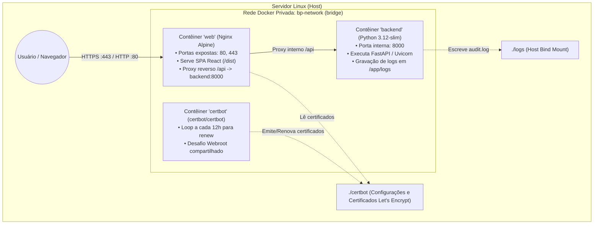

# Especificação Técnica de Design: Deploy em Produção (Docker + Nginx + Certbot)

- **Projeto**: `bp-email-analiser`
- **Data**: 2026-09-15
- **Status**: Aprovado para Implementação
- **Autor**: Antigravity & Breno

---

## 1. Visão Geral e Objetivos

Este documento especifica a infraestrutura e a esteira de deploy para publicação do sistema **BP Email Header Analyzer** (`bp-email-analiser`) em um servidor Linux de produção.

### 1.1 Metas de Design
- **Isolamento e Portabilidade**: Toda a pilha deve ser conteinerizada via Docker e orquestrada via Docker Compose.
- **Terminação SSL Automatizada**: Certificados HTTPS emitidos e renovados de forma transparente pelo Let's Encrypt / Certbot.
- **Roteamento Unificado e Seguro**: O Nginx atua como proxy reverso de borda e servidor dos estáticos do frontend React, aplicando cabeçalhos de segurança (HSTS, CSP, X-Frame-Options) e restringindo a exposição pública do backend.
- **Persistência de Auditoria Forense**: Logs de auditoria forense gravados pelo FastAPI são mantidos no host via volume bind-mount (`./logs`).
- **Deploy Simplificado e Idempotente**: Script `deploy.sh` executável via linha de comando no servidor para atualização contínua com validação de pré-requisitos e healthcheck automático.

---

## 2. Arquitetura da Solução



---

## 3. Componentes da Infraestrutura

### 3.1 Backend (`backend/Dockerfile`)
- **Imagem base**: `python:3.12-slim`.
- **Estratégia**:
  - Instalação de dependências de sistema mínimas necessárias (ex: `curl` para healthcheck).
  - Cópia de `requirements.txt` e instalação com cache do pip desabilitado (`--no-cache-dir`).
  - Criação e permissão do diretório `/app/logs`.
  - Execução via comando:
    ```bash
    uvicorn app.main:app --host 0.0.0.0 --port 8000 --workers 2 --proxy-headers
    ```
  - **Healthcheck**:
    ```dockerfile
    HEALTHCHECK --interval=15s --timeout=5s --start-period=10s --retries=3 \
      CMD curl -f http://localhost:8000/api/health || exit 1
    ```

### 3.2 Frontend & Webserver (`frontend/Dockerfile` & `docker/nginx/`)
- **Build Multi-stage**:
  - **Stage 1 (Builder)**: `node:20-alpine`.
    - Copia `package.json` e `package-lock.json` (se presente).
    - Executa `npm install --frozen-lockfile` (ou `npm install`).
    - Compila TypeScript e bundle Vite via `npm run build`.
  - **Stage 2 (Runtime)**: `nginx:1.27-alpine`.
    - Copia os arquivos gerados no Stage 1 (`/app/dist`) para `/usr/share/nginx/html`.
    - Copia a configuração de proxy e virtualhost (`docker/nginx/nginx.conf` e `docker/nginx/conf.d/default.conf.template`).
    - Configura os volumes compartilhados com o Certbot (`/var/www/certbot` e `/etc/letsencrypt`).

### 3.3 Configuração do Nginx (`docker/nginx/templates/default.conf.template`)
Utilizará substituição de variáveis nativa do Nginx Docker (`$DOMAIN`):
- **Porta 80**:
  - `location /.well-known/acme-challenge/`: Diretório de desafio do Certbot (`/var/www/certbot`).
  - Outras rotas: Redirecionamento permanente HTTP 301 para `https://${DOMAIN}$request_uri`.
- **Porta 443**:
  - Certificados SSL:
    - `ssl_certificate /etc/letsencrypt/live/${DOMAIN}/fullchain.pem;`
    - `ssl_certificate_key /etc/letsencrypt/live/${DOMAIN}/privkey.pem;`
  - Parâmetros TLS: TLSv1.2 e TLSv1.3, ciphers recomendados pela Mozilla Modern, HSTS habilitado (`max-age=31536000; includeSubDomains`).
  - Cabeçalhos de segurança:
    - `X-Frame-Options: SAMEORIGIN`
    - `X-Content-Type-Options: nosniff`
    - `Referrer-Policy: strict-origin-when-cross-origin`
  - Rota SPA:
    - `location /`: `try_files $uri $uri/ /index.html;`
    - `location /assets/`: `expires 1y; add_header Cache-Control "public, immutable";`
  - Rota API:
    - `location /api/`:
      - `proxy_pass http://backend:8000/api/;`
      - `proxy_set_header Host $host;`
      - `proxy_set_header X-Real-IP $remote_addr;`
      - `proxy_set_header X-Forwarded-For $proxy_add_x_forwarded_for;`
      - `proxy_set_header X-Forwarded-Proto $scheme;`
      - `proxy_read_timeout 60s;`
      - `proxy_connect_timeout 10s;`
      - `client_max_body_size 10M;`

### 3.4 Contêiner Certbot (`certbot/certbot`)
- Entrypoint configurado para rodar em loop verificando a renovação a cada 12 horas:
  ```bash
  sh -c "trap exit TERM; while :; do certbot renew; sleep 12h & wait $${!}; done;"
  ```
- Volumes montados:
  - `./certbot/conf:/etc/letsencrypt`
  - `./certbot/www:/var/www/certbot`

---

## 4. Orquestração (`docker-compose.yml`)

O arquivo raiz `docker-compose.yml` centraliza os 3 serviços:

```yaml
version: '3.8'

services:
  backend:
    build:
      context: ./backend
      dockerfile: Dockerfile
    container_name: bp-backend
    restart: unless-stopped
    env_file:
      - .env
    volumes:
      - ./logs:/app/logs
    networks:
      - bp-network
    healthcheck:
      test: ["CMD", "curl", "-f", "http://localhost:8000/api/health"]
      interval: 15s
      timeout: 5s
      retries: 3
      start_period: 10s

  web:
    build:
      context: .
      dockerfile: ./frontend/Dockerfile
      args:
        - VITE_API_URL=/api
    container_name: bp-web
    restart: unless-stopped
    ports:
      - "80:80"
      - "443:443"
    environment:
      - DOMAIN=${DOMAIN}
    volumes:
      - ./certbot/conf:/etc/letsencrypt:ro
      - ./certbot/www:/var/www/certbot:ro
    depends_on:
      backend:
        condition: service_healthy
    networks:
      - bp-network

  certbot:
    image: certbot/certbot:latest
    container_name: bp-certbot
    restart: unless-stopped
    volumes:
      - ./certbot/conf:/etc/letsencrypt
      - ./certbot/www:/var/www/certbot
    entrypoint: >
      sh -c "trap exit TERM; while :; do certbot renew --webroot -w /var/www/certbot --quiet; sleep 12h & wait $${!}; done;"
    networks:
      - bp-network

networks:
  bp-network:
    driver: bridge
```

---

## 5. Bootstrap de SSL (`scripts/init-ssl.sh`)

Para resolver a dependência circular (o Nginx precisa de certificados para subir com HTTPS, mas o Certbot precisa do Nginx ativo para validar o desafio HTTP), criamos o script `scripts/init-ssl.sh`:

1. Lê variáveis `DOMAIN`, `LETSENCRYPT_EMAIL` e `CERTBOT_STAGING` do `.env`.
2. Cria estrutura de diretórios locais (`certbot/conf/live/$DOMAIN` e `certbot/www`).
3. Se não houver certificados válidos, gera um certificado autoassinado temporário dummy via OpenSSL para `${DOMAIN}`.
4. Sobe o serviço `web` via `docker compose up -d web`.
5. Remove o certificado dummy temporário.
6. Dispara o `certbot certonly --webroot` solicitando os certificados reais para o domínio.
7. Recarrega a configuração do Nginx via `docker compose exec web nginx -s reload`.

---

## 6. Script de Deploy Automatizado (`deploy.sh`)

Script idempotente para atualização em produção:

```bash
#!/usr/bin/env bash
set -e

# 1. Validações prévias
# - Verifica se docker e docker compose estão instalados
# - Verifica se .env existe e possui DOMAIN configurado
# - Garante diretório ./logs com permissões adequadas

# 2. Atualização de código
git pull origin main

# 3. Build e subida dos serviços
docker compose build --pull
docker compose up -d --remove-orphans

# 4. Verificação de Saúde (Healthcheck)
# - Executa até 10 tentativas com sleep 2s consultando http://localhost/api/health ou backend:8000
# - Confirma código HTTP 200

# 5. Limpeza
docker image prune -f

echo "Deploy finalizado com sucesso!"
```

---

## 7. Configuração de Variáveis de Ambiente (`.env.production.example`)

O arquivo conterá os parâmetros documentados:
```ini
# Domínio e Certificado
DOMAIN=analyzer.exemplo.com
LETSENCRYPT_EMAIL=admin@exemplo.com
CERTBOT_STAGING=0

# Backend FastAPI
PROJECT_NAME=bp-email-analiser
API_PREFIX=/api
NETWORK_TIMEOUT_SECONDS=2.5
MAX_HEADER_SIZE_BYTES=1000000

# Auditoria e Logs
AUDIT_LOG_ENABLED=True
AUDIT_LOG_LEVEL=FULL
AUDIT_LOG_FILE=logs/audit.log
AUDIT_LOG_MAX_BYTES=10485760
AUDIT_LOG_BACKUP_COUNT=5
AUDIT_LOG_STDOUT=True
```

---

## 8. Guia de Operação e Comandos Úteis

| Ação | Comando |
|---|---|
| **Deploy / Atualização** | `./deploy.sh` |
| **Inicialização SSL (primeira vez)** | `./scripts/init-ssl.sh` |
| **Visualizar status dos serviços** | `docker compose ps` |
| **Logs da aplicação em tempo real** | `docker compose logs -f web backend` |
| **Logs forenses de auditoria** | `tail -f logs/audit.log` |
| **Parar a aplicação** | `docker compose down` |
| **Forçar renovação manual de certificados** | `docker compose run --rm certbot renew` |

---

## 9. Plano de Verificação e Testes
1. **Validação dos Dockerfiles**:
   - Build individual do `backend/Dockerfile` e teste do endpoint `/api/health`.
   - Build do `frontend/Dockerfile` e verificação da saída em `/usr/share/nginx/html`.
2. **Validação do Compose**:
   - Subida completa em ambiente local/staging com porta alternativa para teste sintético.
3. **Validação de Persistência**:
   - Envio de requisição forense e confirmação de escrita em `./logs/audit.log` no host.
4. **Validação do Script de Deploy**:
   - Execução com flags `--dry-run` ou teste de idempotência.
